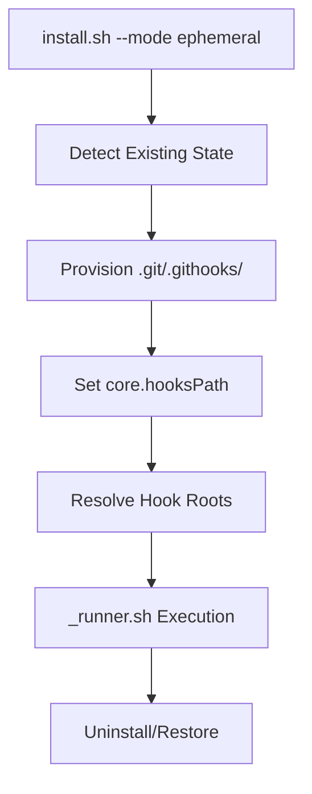

## Overview

Ephemeral Mode layers a local-only toolkit installation inside `.git/.githooks/`, redirecting `core.hooksPath` to this private root so developers can run toolkit hooks in third-party repositories without touching tracked files. The design preserves the existing `_runner.sh` architecture while introducing an overlay manager, lifecycle controller, and CLI extensions to orchestrate install, upgrade, and uninstall flows.

## Steering Document Alignment

### Technical Standards (tech.md)
- POSIX sh compatibility is maintained by reusing current shell libraries in `lib/`.
- Git interactions rely on `git config`, `git rev-parse`, and existing helper wrappers to stay portable.
- Hooks continue to execute sequentially via `_runner.sh`, honoring deterministic ordering.

### Project Structure (structure.md)
- New lifecycle logic lives under `lib/` (e.g., `lib/ephemeral.sh`) mirroring existing modular shell components.
- CLI entry points remain in `install.sh`, adding `--mode ephemeral` branches instead of new binaries.
- Ephemeral assets reside at `.git/.githooks/` with subdirectories consistent with versioned installs (`_runner.sh`, `hooks`, `parts`).

## Code Reuse Analysis

- **Existing common.sh helpers:** for logging, error handling, permission checks.
- **Current `_runner.sh`:** reused without fork; ephemeral-specific configuration supplies contextual environment variables.
- **Stage management utilities:** leveraged for hook discovery and part ordering logic.

### Existing Components to Leverage
- **`lib/config.sh`:** extend to snapshot and restore `core.hooksPath` and detect custom values.
- **`lib/install_common.sh`:** share directory creation logic and stub templating.

### Integration Points
- **Git CLI:** local `git config --local` updates for hooks path.
- **File system layout:** interacts with `.git/hooks`, `.git/.githooks/`, and optional versioned `.githooks/`.

## Architecture

Ephemeral Mode introduces a lifecycle consisting of (1) detection, (2) provisioning ephemeral directories, (3) configuring Git, (4) managing overlay precedence, and (5) teardown. Execution continues through `_runner.sh`, which reads hook parts from ordered roots that include ephemeral and optionally versioned directories.

### Modular Design Principles
- **Single File Responsibility:** `lib/ephemeral_lifecycle.sh` handles install/uninstall; `lib/ephemeral_overlay.sh` handles root resolution.
- **Component Isolation:** CLI dispatch code only delegates; business logic resides in lib modules; runner behavior remains isolated.
- **Service Layer Separation:** config snapshots, filesystem operations, and CLI messaging are distinct functions.
- **Utility Modularity:** shared helpers for traps, permission setting, and logging avoid duplication.



## Components and Interfaces

### EphemeralLifecycle (lib/ephemeral_lifecycle.sh)
- **Purpose:** Orchestrate install, refresh, and uninstall flows.
- **Interfaces:** `ephemeral_install`, `ephemeral_refresh`, `ephemeral_uninstall`.
- **Dependencies:** `lib/config.sh`, `lib/filesystem.sh`, `lib/logging.sh`.
- **Reuses:** directory creation utilities, permission helpers, trap registration.

### EphemeralOverlay (lib/ephemeral_overlay.sh)
- **Purpose:** Determine hook part search roots and precedence.
- **Interfaces:** `ephemeral_resolve_roots`, `ephemeral_print_roots`, `ephemeral_apply_precedence_config`.
- **Dependencies:** repository detection utilities, environment/config getters.
- **Reuses:** existing stage listing logic for `.githooks/<hook>.d` structure.

### CLI Dispatcher (install.sh)
- **Purpose:** Parse `--mode ephemeral` arguments for install/uninstall.
- **Interfaces:** `handle_install_ephemeral`, `handle_uninstall_ephemeral`.
- **Dependencies:** argument parser, lifecycle functions.
- **Reuses:** existing messaging patterns for install/uninstall confirmation.

## Data Models

### Ephemeral State Manifest
```
manifest.sh
- VERSION=<semver>
- PREVIOUS_CORE_HOOKS_PATH=<string or empty>
- PRECEDENCE_MODE=<ephemeral-first|versioned-first|merge>
- ROOTS=<colon-separated list>
```

### Hook Roots Configuration
```
hooks_roots.conf
- root[0]=.git/.githooks/parts
- root[1]=.githooks/parts (optional)
- root[n]=<user-defined>
```

## Error Handling

### Error Scenarios
1. **core.hooksPath Mutations Fail**
   - **Handling:** Abort install, restore snapshot, warn user; exit non-zero.
   - **User Impact:** Message instructing to inspect Git config permissions.

2. **Ephemeral Directory Creation Fails**
   - **Handling:** Abort, print permission guidance, leave repo untouched.
   - **User Impact:** Clear error stating location and required action.

3. **Overlay Detection Conflict**
   - **Handling:** Log conflicting roots, default to safe precedence, guide user to configure explicitly.
   - **User Impact:** Warning message referencing docs section.

## Testing Strategy

### Unit Testing
- Shell unit tests verifying lifecycle functions set up directories and configs correctly.
- Mock Git config interactions to ensure snapshot/restore logic.

### Integration Testing
- End-to-end script that installs ephemeral mode, runs sample hooks, performs `git reset --hard`, and validates persistence.
- Test overlay precedence when both ephemeral and versioned roots are present.

### End-to-End Testing
- Manual validation across Linux, macOS, and Windows Git Bash verifying install/uninstall idempotence and hook execution order.
