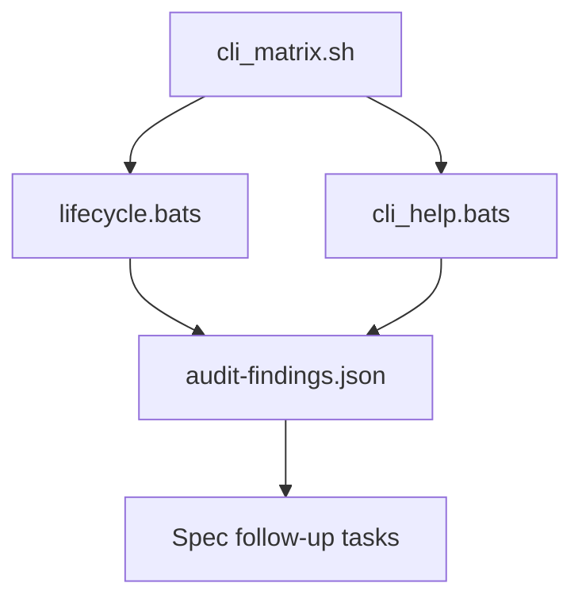

# Design Document

## Overview

This effort introduces a structured testing-audit pipeline that inventories every CLI command, subcommand, and flag (including both `help` and `--help` surfaces), exercises install/uninstall lifecycles across standard and ephemeral modes, and captures reproducible diagnostics for all failures. The design focuses on producing actionable artefacts—command matrices, overlay log snapshots, manifest assertions—so follow-up tickets can address gaps with minimal rediscovery effort.

## Steering Document Alignment

### Technical Standards (tech.md)
- Maintain POSIX-sh compatibility for new helper scripts so they integrate with existing installer tooling.
- Reuse established Bats harness patterns located in `tests/helpers/` to keep sandbox creation and Git interactions consistent.

### Project Structure (structure.md)
- Store new audit automation beside existing integration suites under `tests/`, using `tests/audit/` for matrix runners and fixtures.
- Persist machine-readable audit outputs (e.g. JSON summaries) under `tests/audit/output/` to avoid touching documentation assets.

## Code Reuse Analysis

### Existing Components to Leverage
- **`tests/helpers/git_repo.sh`**: Provides sandbox repos, manifest helpers, and installer path resolution for Bats tests.
- **`tests/lib/git_test_helpers.sh`**: Supplies low-level Git execution, sandbox lifecycle, and file utilities required by new matrix scripts.
- **`lib/ephemeral_overlay.sh`**: Source of overlay resolution routines; use it to validate observed precedence logs against expected root ordering.
- **`tests/ephemeral/*.bats`**: Reference for existing ephemeral lifecycle assertions; extend these patterns when adding coverage.

### Integration Points
- **Installer entrypoint (`install.sh`)**: Audit scripts will invoke the CLI directly using sandbox repositories to exercise flag permutations.
- **Spec workflow outputs**: The audit will feed findings into structured artefacts (`audit-findings.json`) that downstream spec tasks consume.

## Architecture

The audit pipeline consists of three layers:
1. **Command Matrix Runner** (`tests/audit/cli_matrix.sh`): Generates permutations of commands, subcommands, flags, and help invocations, recording exit codes, stdout/stderr checksums, and notable anomalies.
2. **Lifecycle Verifier** (`tests/audit/lifecycle.bats`): Wraps the runner in Bats tests, performing deep assertions on hooks-path, manifest restoration, overlay ordering, and regression checks for truncated log paths.
3. **Findings Aggregator** (`tests/audit/report.sh`): Consolidates raw matrix results into sorted JSON and human-readable summaries, highlighting missing automated coverage or failures.

### Modular Design Principles
- **Single File Responsibility**: Shell runners handle data gathering only; Bats tests perform assertions; the aggregator formats output.
- **Component Isolation**: Each command domain (install/uninstall, stage family, hooks/config, legacy aliases) has a dedicated Bats test file.
- **Service Layer Separation**: Helper functions that compute permutations reside in `tests/audit/lib/`, keeping test cases declarative.
- **Utility Modularity**: Shared formatting utilities (e.g. JSON emitters) will be introduced as separate scripts to avoid entangling auditing logic with installers.



## Components and Interfaces

### Component 1 — CLI Matrix Runner (`tests/audit/cli_matrix.sh`)
- **Purpose:** Enumerate every command/subcommand/flag/help variant and capture their outputs in sandbox repos.
- **Interfaces:** `run_matrix <manifest-path>` (writes NDJSON records), `emit_case <command> <args...>`.
- **Dependencies:** `tests/helpers/git_repo.sh`, core CLI binaries, `jq` (optional—fallback to pure shell JSON writer if unavailable).
- **Reuses:** Git sandbox helpers for repo setup and teardown.

### Component 2 — Lifecycle Verifier (`tests/audit/lifecycle.bats`) _(Approved)_
- **Purpose:** Assert behaviours around install/uninstall cycles, manifest persistence, overlay ordering, and log completeness.
- **Interfaces:** `load_matrix_records <path>` to stream NDJSON, `expect_lifecycle_case <case-id> <hooks-path> <overlay-mode>` for deterministic assertions, and `record_lifecycle_failure <case-id> <note>` to emit actionable diagnostics.
- **Dependencies:** CLI Matrix Runner outputs, `lib/ephemeral_overlay.sh` for expected overlay roots, `tests/helpers/assertions.sh` for coloured diff output.
- **Reuses:** Existing ephemeral lifecycle assertions extended with NDJSON-backed expectations and truncated-log detection.
- **Outputs:** Emits structured failure logs that include matrix case IDs, observed versus expected overlay ordering, and hooks-path lineage.

### Component 2a — Ephemeral Lifecycle Extension (`tests/ephemeral/lifecycle.bats`)
- **Purpose:** Tie legacy ephemeral tests to the audit matrix so parity remains between the audit suite and existing regression harness.
- **Interfaces:** Sources shared lifecycle helpers (`tests/audit/lib/lifecycle_matrix.sh`) and calls `assert_overlay_precedence` and `assert_hooks_path_restored` with live sandbox state.
- **Dependencies:** Matrix NDJSON output from Component 1 alongside `lib/ephemeral_overlay.sh`.
- **Reuses:** Existing setup/teardown flows to minimise churn while tightening assertions.

### Component 3 — Help Surface Collector (`tests/audit/cli_help.bats` + `tests/audit/lib/help_snapshot.sh`)
- **Purpose:** Snapshot `help` and `--help` output for every command/subcommand pair, reporting mismatches or missing coverage.
- **Interfaces:** `collect_help <command>` (returns checksum + path), `assert_help_documented <command>`.
- **Dependencies:** Installer CLI, matrix runner.
- **Reuses:** Sandbox helpers; leverages existing usage printers inside `install.sh`.

### Component 4 — Findings Aggregator (`tests/audit/report.sh`)
- **Purpose:** Convert raw NDJSON into summary tables (`audit-findings.json`, `audit-findings.txt`) detailing failures, missing tests, and suggested follow-ups.
- **Interfaces:** `build_report <matrix-file> <output-json> <output-text>`.
- **Dependencies:** Matrix runner output; optional `jq`; fallback to shell string operations.
- **Reuses:** None beyond POSIX primitives to stay portable.

## Data Models

### `audit_case` record (NDJSON)
```
{
  "id": string,              # deterministic case identifier (e.g. install--mode-ephemeral--help)
  "command": string,         # executed command
  "args": [string],          # arguments supplied
  "exit_code": integer,      # process status
  "stdout_crc": string,      # checksum for regression detection
  "stderr_crc": string,      # checksum for regression detection
  "hooks_path": string,      # effective hooks path after command (if applicable)
  "overlay_roots": [string], # ordered roots observed in logs
  "notes": [string]          # anomalies or TODOs
}
```

### `audit_summary` record
```
{
  "case_id": string,
  "status": "pass" | "fail" | "missing-test",
  "issue_type": "log-truncation" | "flag-gap" | "coverage-gap" | "alias-divergence",
  "details": string
}
```

## Error Handling

### Error Scenarios
1. **Matrix execution failure:**
   - **Handling:** The runner records a `fail` summary with captured stderr and continues processing remaining cases.
   - **User Impact:** Audit results flag the case for follow-up without aborting the entire run.

2. **Missing dependency (e.g. `jq`):**
   - **Handling:** Fallback to pure-shell JSON emission; log a warning in `notes` so follow-up tasks can decide whether to vendor tooling.
   - **User Impact:** Audit completes with slightly less friendly formatting but retains content.

3. **Unexpected help output drift:**
   - **Handling:** Help collector stores snapshots under `tests/audit/output/help/<case>.txt` and marks the summary as `fail` with diff hints.
   - **User Impact:** Contributors receive concrete repro steps and captured output for review.

## Testing Strategy

### Unit Testing
- Add shell-unit tests for new helper libraries (`tests/audit/lib/*.sh`) using Bats to validate permutation generation and JSON formatting in isolation.
- Introduce checksum verification tests that ensure overlay root logging never truncates path prefixes.

### Integration Testing
- Extend `tests/ephemeral/lifecycle.bats` with new cases verifying overlay logs, standard mode parity, and manifest restoration under permutations produced by the matrix runner. Source the shared lifecycle helper library to avoid duplicating NDJSON parsing logic.
- Add dedicated Bats suites for `stage`, `hooks`, and `config` commands to consume matrix outputs and assert flag/help coverage.

### End-to-End Testing
- Provide a top-level `tests/audit/run.sh` that executes the full matrix + report pipeline inside CI, emitting summaries and failing the job when new `fail` or `missing-test` entries appear.
- Document invocation in CI configuration notes (future task) to ensure the audit gate runs before release branches.
