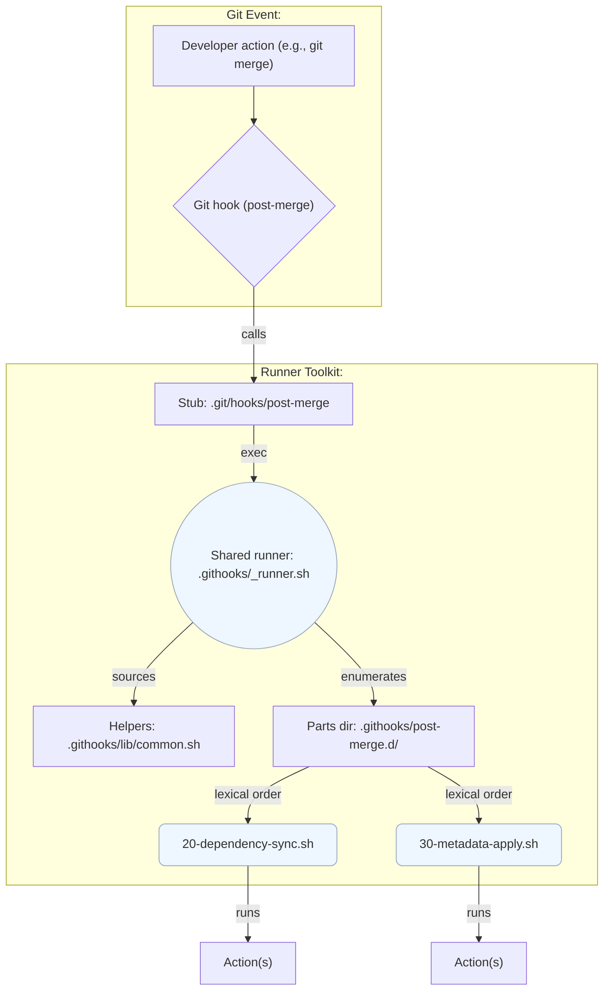
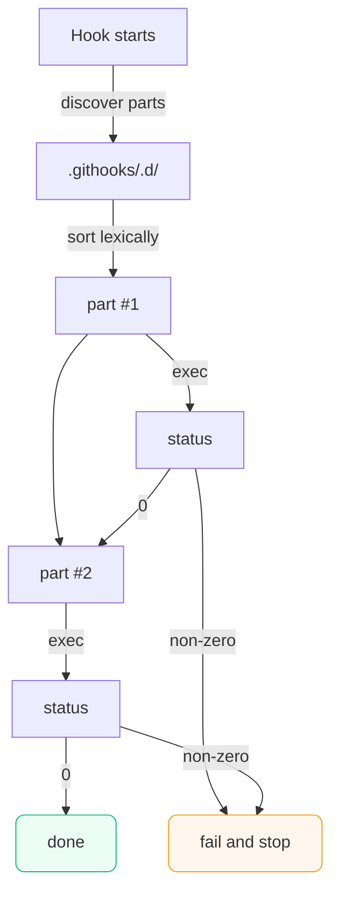

# Git Hooks Runner Toolkit

Composable, version-controlled Git hooks you can actually maintain.

> Keep your Git automation in your repo—not in someone’s shell history. This toolkit installs a small, universal **hook runner** that executes any number of **hook parts** you place in `.githooks/<hook>.d/`. Parts are ordinary executable shell scripts, run in deterministic lexical order.

---

## Why this exists

- **Version-controlled hooks**: Ship repeatable workflows with the codebase.
- **Composable by design**: Add tiny “parts” instead of one giant hook.
- **Deterministic**: Parts run in lexical order; the runner stops on first failure.
- **Safe defaults**: Robust logging, stdin handling, worktree/bare repo awareness.
- **Zero hard dependencies**: Plain Bash + Git. Optional tools are probed at runtime.

---

## How it works (at a glance)



---

## Requirements

- **Git** 2.x (worktrees and modern plumbing commands)
- **POSIX shell** (`/bin/sh`); runner and examples are now pure POSIX with optional Bash niceties detected at runtime
- **macOS/Linux/WSL** supported. On native Windows, prefer WSL or copy files instead of symlinks.

---

## Install this toolkit into your project (root-first, one-time)

> Run all commands from your **project’s repo root**. The official repository URL is `https://github.com/DevGuyRash/git-hooks-runner-toolkit.git`.

**Clone the toolkit:**

```bash
git clone https://github.com/DevGuyRash/git-hooks-runner-toolkit.git git-hooks && rm -rf git-hooks/.git
```

> The toolkit now lives at **`git-hooks/`** in your repo root. The installer and runner are path-agnostic after this step.

---

## Quick start (from your repo root)

```bash
git-hooks/install.sh

# Optional: choose specific hooks
git-hooks/install.sh --hooks post-merge,post-rewrite,post-checkout

# Inspect what was installed
ls .git/hooks
ls .githooks
```

What you get:

- Managed stubs in `.git/hooks/<hook>` that **delegate** to the shared runner
- A shared runner & helpers in `.githooks/`
- Per-hook parts directories like `.githooks/post-merge.d/`

> Re-run the installer any time. Use `--dry-run` to preview changes, `--force` to overwrite existing stubs.

## Stage toolkit parts without manual copying

The installer can now build a staging plan from explicit selectors—no more ad-hoc copying. The modern flags are additive and order-aware.

### Quick recipes

```bash
# pull every example and template (default behaviour)
git-hooks/install.sh --stage

# stage only the GitCrypt enforcement sample
git-hooks/install.sh --stage-source examples --stage-name git-crypt-enforce.sh

# stage custom scripts from scripts/hooks/ for post-merge and post-rewrite
git-hooks/install.sh \
  --stage-source scripts/hooks \
  --stage-hook post-merge --stage-hook post-rewrite

# preview the plan grouped by hook, without touching disk
git-hooks/install.sh --stage-source examples \
  --stage-name dependency-sync.sh \
  --stage-order hook --stage-summary --dry-run

# combine multiple sources; later entries override earlier ones when --force is used
git-hooks/install.sh \
  --stage-source examples \
  --stage-source hooks \
  --stage-name metadata-apply.sh --stage-name 10-sample-template.sh
```

Selectors are merged in the order you supply them. `--stage-source` defines where to look, `--stage-hook` constrains which hooks receive copies, and `--stage-name` acts as a basename allow-list. If a selector category is omitted, everything in that category is allowed.

### Fine-grained selector reference

| Option | Short | Description |
| --- | --- | --- |
| `--stage-source <dir>` | `-S` | Add a directory to scan (absolute, `~`, or toolkit-relative). Keywords `examples` and `hooks` expand to the bundled folders. |
| `--stage-hook <hook>` | `-G` | Limit staging to specific Git hook names. Intersects with `--hooks`/`--all-hooks`. |
| `--stage-name <file>` | `-N` | Allow only scripts with the given basename. Multiple flags append additional names. |
| `--stage-order <strategy>` | – | Control plan ordering: `source` (default), `hook`, or `name`. |
| `--stage-summary` | `-M` | Print plan lines (`PLAN: hook=… name=… source=…`) before execution. Implied by `--dry-run`. |
| `--stage` | `-s` | Legacy convenience flag (`--stage` 7 `--stage-source examples --stage-source hooks`). Passing values such as `--stage=examples,hook:pre-commit` is still supported but emits a compatibility warning. |

Other useful flags carry over:

- `--dry-run` / `-n` prints the planned actions without copying.
- `--force` / `-f` lets later sources override earlier ones when the same `<hook>/<basename>` destination appears more than once.
- `--hooks`, `--all-hooks`, and `--uninstall` behave exactly as in install mode.

### Declaring targets inside scripts

Add `# githooks-stage: pre-commit,post-merge` near the top of a script to explicitly declare hook targets. Metadata beats directory heuristics; if metadata is absent we fall back to folder names such as `hooks/pre-commit/` or `hooks/pre-commit.d/`. When neither source hints nor metadata reveal a hook and you invoked `--hooks`, the installer copies into that explicit set; otherwise the file is skipped.

### Legacy shorthand

Older comma selectors (e.g. `--stage=examples,hook:pre-commit`) continue to work and now raise a reminder to upgrade. Use `--stage-source`, `--stage-hook`, and `--stage-name` for clearer intent and deterministic ordering.

---

## Add your first automation (two minutes)

Create a part that runs a linter on staged files:

```bash
cat > .githooks/pre-commit.d/20-lint.sh <<'SH'
#!/usr/bin/env bash
set -euo pipefail

# Example: run eslint if available; otherwise just log and exit 0
if command -v eslint >/dev/null 2>&1; then
  echo "[hook] INFO: running eslint"
  eslint .
else
  echo "[hook] WARN: eslint not found; skipping"
fi
SH
chmod +x .githooks/pre-commit.d/20-lint.sh
```

Commit something—your part will run automatically.

---

## Shipping the provided example parts (root-first)

These examples live in **`git-hooks/examples/`**. Each script now declares its target hooks via `# githooks-stage:` metadata, so a single staging command installs them without manual copying:

```bash
# install every example script into its declared hooks
git-hooks/install.sh --stage=examples
```

Want a narrower set? Combine selectors to filter by script name and/or hook:

```bash
# install only the dependency sync helper
git-hooks/install.sh --stage=examples,name:dependency-sync.sh

# install only example pre-commit hooks
git-hooks/install.sh --stage=examples,hook:pre-commit
```

### 1) Dependency manifest sync — `dependency-sync.sh`

Scans for dependency manifest changes (Node, Bun, Composer, Python, Go, Rust, Ruby, Elixir, uv, etc.) and invokes the matching installer so collaborators stay in sync without remembering manual steps.

**Stage it:**

```bash
git-hooks/install.sh \
  --stage-source examples \
  --stage-name dependency-sync.sh \
  --stage-order hook --stage-summary
```

**Built-in mappings (what it reacts to):**

| Pattern(s)                                                 | Action (when tool exists)                                 |
| ---------------------------------------------------------- | --------------------------------------------------------- |
| `package-lock.json`, `npm-shrinkwrap.json`, `package.json` | `npm install --no-fund`                                   |
| `yarn.lock`                                                | `yarn install --frozen-lockfile`                          |
| `pnpm-lock.yaml`                                           | `pnpm install --frozen-lockfile`                          |
| `bun.lock`, `bun.lockb`                                    | `bun install`                                             |
| `composer.lock`                                            | `composer install --no-interaction --no-progress --quiet` |
| `requirements.txt` *(if file exists)*                      | `pip install -r requirements.txt`                         |
| `go.mod`, `go.sum`                                         | `go mod download`                                         |
| `Cargo.toml`, `Cargo.lock`                                 | `cargo fetch`                                             |
| `poetry.lock`                                              | `poetry install`                                          |
| `Pipfile.lock`                                             | `pipenv sync`                                             |
| `uv.lock`, `uv.toml`                                       | `uv sync`                                                 |
| `Gemfile.lock`                                             | `bundle install --quiet`                                  |
| `mix.lock`                                                 | `mix deps.get`                                            |

- **Prerequisites**: ensure whichever package managers you rely on (`npm`, `yarn`, `pnpm`, `bun`, `composer`, `pip`, `go`, `cargo`, `poetry`, `pipenv`, `uv`, `bundle`, `mix`, …) are installed; missing tools are logged and skipped without failing the hook.

Notes:

- Triggers only when those files changed for the current hook.
- Commands are **optional**: missing tools are detected and logged; the hook still succeeds.
- Set `GITHOOKS_DEPENDENCY_SYNC_MARK_FILE` (legacy: `GITHOOKS_CHANGE_MARK_FILE`) to write a machine-readable summary for CI/tests.

### 2) Configurable change watcher — `watch-configured-actions.sh`

Evaluates changed paths against a YAML or JSON configuration so you can run custom command sets for overlapping file globs (supports `*` and recursive `**`). Each rule can run multiple commands and opt into `continue_on_error` semantics so failures either stop the hook or are logged while the hook continues.

**Stage it:**

```bash
git-hooks/install.sh --stage-source examples --stage-name watch-configured-actions.sh -M
```

Place a config at `.githooks/watch-config.yaml` (or `.yml` / `.json`) or point `GITHOOKS_WATCH_CONFIG` to your chosen path. Example YAML:

```yaml
- name: shared-json-and-yaml
  patterns: ["*.json", "*.yaml"]
  commands:
    - "npm run lint-configs"
- name: yaml-only
  patterns:
    - "config/**/*.yaml"
  commands:
    - "scripts/validate-yaml.sh"
  continue_on_error: false
- name: docs-touch
  patterns: ["docs/**/*.md", "*.yaml"]
  commands:
    - "scripts/render-docs.sh"
  continue_on_error: true
```

Example JSON (identical semantics):

```json
[
  {
    "name": "shared-json-and-yaml",
    "patterns": ["*.json", "*.yaml"],
    "commands": ["npm run lint-configs"]
  },
  {
    "name": "yaml-only",
    "patterns": ["config/**/*.yaml"],
    "commands": ["scripts/validate-yaml.sh"],
    "continue_on_error": false
  },
  {
    "name": "docs-touch",
    "patterns": ["docs/**/*.md", "*.yaml"],
    "commands": ["scripts/render-docs.sh"],
    "continue_on_error": true
  }
]
```

Dependencies: install [`yq`](https://github.com/mikefarah/yq) when using YAML configs and [`jq`](https://jqlang.github.io/jq/) for JSON configs; the hook exits with a warning if the required tool is missing. As a tool-free fallback, you can define inline rules via the environment (mirroring the YAML structure, one rule per line) before invoking the hook:

```bash
export WATCH_INLINE_RULES='name=shared-json-and-yaml patterns=*.json,*.yaml commands="npm run lint-configs"
name=yaml-only patterns=config/**/*.yaml commands="scripts/validate-yaml.sh"
name=docs-touch patterns=docs/**/*.md,*.yaml continue_on_error=true commands="scripts/render-docs.sh"'
```

Ports of interest:

- `patterns`: list of globs (`*` and `**` supported) matched against changed paths.
- `commands`: each entry is executed with `sh -c`. Omit to log matches without running anything.
- `continue_on_error`: when `true`, failed commands log and the hook keeps going; otherwise the hook stops on first failure.
- Set `GITHOOKS_WATCH_MARK_FILE` to capture a machine-readable summary of matched rules and commands.

### 3) Filesystem metadata apply — `metadata-apply.sh`

Restores permissions, ownership, and extended attributes recorded by [`metastore`](https://github.com/prashanths/metastore) so executable or special files remain consistent after merges and checkouts.

**Stage it:**

```bash
git-hooks/install.sh \
  --stage-source examples \
  --stage-name metadata-apply.sh \
  --stage-order hook
```

Environment:

- `METASTORE_FILE` (default `.metadata`)
- `METASTORE_APPLY_ARGS` (optional extra flags)
- `GITHOOKS_METADATA_APPLY_MARK` (optional status mark file)

**Prerequisite**: install `metastore` (e.g., `pip install metastore`, `brew install metastore`). If it isn’t available on `PATH`, the part logs a warning and exits 0 without changing anything.

### 4) Secrets encryption enforcement — `git-crypt-enforce.sh`

Guards against leaking secrets by refusing commits that stage plaintext for paths covered by `git-crypt`; it inspects the staged blob to ensure encrypted content contains the `\0GITCRYPT\0` sentinel before allowing the commit.

**Stage it:**

```bash
git-hooks/install.sh --stage-source examples --stage-name git-crypt-enforce.sh --stage-hook pre-commit
```

Behaviour and configuration:

- Fails if files marked with `filter=git-crypt*` would be committed without the `\0GITCRYPT\0` header.
- Rejects mixed commits that touch `.gitattributes` alongside other paths (override once with `GITCRYPT_ALLOW_MIXED_GITATTRIBUTES=1`).
- Optional helpers:
  - `GITCRYPT_AUTO_FIX=1` runs `git-crypt status -f` once to restage encrypted blobs automatically.
  - `GITCRYPT_STRICT_HEAD=1` fails until existing plaintext in `HEAD` is cleaned up.
- Requires an unlocked repository (`git-crypt unlock`) so that `git show :path` exposes the encrypted blob.
- Logs via the shared runner namespace so failures are easy to spot in CI and during local commits.

**Prerequisite**: install [git-crypt](https://www.agwa.name/projects/git-crypt/) and initialize/unlock it in your repository (`git-crypt init`, `git-crypt unlock`). If `git-crypt` isn’t on `PATH`, the part blocks with a clear diagnostic so secrets never slip by silently.

**What “shipping” means**:

1. Install the runner (stubs + `.githooks/`).
2. Place example scripts into the relevant `.githooks/<hook>.d/` folders (via **copy** or absolute **symlink**).
3. Name them with a numeric prefix (`NN-...`) to control order. Lower numbers run first.

> Tip: `sh git-hooks/tests/test_git_hooks_examples.sh` provisions sandboxes and smoke-tests all three examples end-to-end.

---

## Hook dispatch flow



---

## Advanced install options

- **Subset of hooks**:

  ```bash
  git-hooks/install.sh --hooks post-merge,pre-push
  ```

- **Respect custom `core.hooksPath`**: The runner detects and installs into your configured hooks directory.
- **Bare repositories**: Supported; the runner places artefacts inside `hooks/` under the bare repo.
- **Uninstall** (keeps your `.githooks/*` parts):

  ```bash
  git-hooks/install.sh --uninstall
  # or just one hook
  git-hooks/install.sh --uninstall --hooks post-merge
  ```

### How `--hooks` works (and installing “all”)

`--hooks` does **not** auto-discover hooks. It’s a comma-separated list of **hook names** you want the installer to manage. The installer will:

1. write a stub at `.git/hooks/<hook>` (or your `core.hooksPath`), and
2. ensure a matching parts directory at `.githooks/<hook>.d/`.

> Git only invokes *real* Git hooks (e.g., `pre-commit`, `post-merge`). Passing an unknown name won’t error; it just won’t ever run.

- **Default set** (when you omit `--hooks`):
  `post-merge, post-rewrite, post-checkout, pre-commit, prepare-commit-msg, commit-msg, post-commit, pre-push`.

- **Install every hook Git documents** (client + server + P4):

  ```bash
  git-hooks/install.sh --all-hooks
  ```

  Pair with `--dry-run` to inspect the planned stubs before committing to the full matrix.

- **Curate your own set**:

  ```bash
  git-hooks/install.sh --hooks applypatch-msg,pre-push,post-merge,post-update
  ```

---

## Updating the toolkit later

Re-clone this repo (or pull latest) somewhere temporary and copy **over** your project’s `git-hooks/` using `rsync -a`. Then re-run the installer. Use `--dry-run` first in CI or automation.

---

## Writing parts (guidelines)

- **Start with strict Bash**: `#!/usr/bin/env bash`, `set -euo pipefail`, and `IFS=$'\n\t'` keep execution predictable across platforms.
- **Keep them executable and ordered**: `chmod +x .githooks/<hook>.d/NN-name.sh`; the numeric prefix controls order within the hook.
- **Favour small, idempotent snippets**: parts may run more than once (e.g., post-checkout on branch switches), so make reruns cheap.
- **Log with context**: use `githooks_log_info|warn|error` (sourced from `lib/common.sh`) to make CI and developer output consistent.
- **Treat dependencies as optional by default**: check tools with `command -v` and log a warning rather than failing unless the hook must hard-stop.
- **Lean on runner context**:
  - `GITHOOKS_HOOK_NAME` — name of the running hook
  - `GITHOOKS_REPO_ROOT` — absolute repo root (or git dir for bare repos)
  - `GITHOOKS_STDIN_FILE` — path to whatever Git wrote to stdin (maps for post-rewrite, ref updates for push hooks, etc.)
- **Share helpers**: sourcing `.githooks/lib/common.sh` gives access to logging, mark-file helpers, and directory discovery, keeping parts tidy.
- **Add targeted change detection**: compute diffs inside the hook (see `dependency-sync.sh` and `watch-configured-actions.sh`) so expensive tasks only run when relevant paths changed.

---

## Troubleshooting

- **“missing shared library”** when a hook fires → run `git-hooks/install.sh` again.
- **“no parts registered”** → create `.githooks/<hook>.d/` and add an executable script.
- **Warnings about missing tools** → expected; install the optional tool or ignore.
- **Windows symlinks** → if symlinks are blocked, copy example scripts instead of `ln -s`.

---

## Testing

The repository ships TAP-compatible harnesses that provision disposable repos, exercise hooks, and clean up afterwards (run these from inside the toolkit directory, e.g. `git-hooks/`):

```bash
sh tests/test_git_hooks_runner.sh      # runner + hook coverage (POSIX)
sh tests/test_git_hooks_examples.sh    # example parts (modular per-example scripts)
```

All hook parts are written for plain POSIX `sh`; run lightweight syntax checks with the three major interpreters to stay honest (again from inside the toolkit directory):

```bash
sh -n examples/dependency-sync.sh
bash -n examples/dependency-sync.sh
zsh -n examples/dependency-sync.sh
sh -n examples/watch-configured-actions.sh
bash -n examples/watch-configured-actions.sh
zsh -n examples/watch-configured-actions.sh
```

Each example script can also be executed on its own (`sh tests/examples/<name>.sh`) for targeted debugging.

Both scripts create their own temporary remotes/worktrees, so they are safe to run from any machine or CI job.

---

## Contributing

PRs welcome—especially new reusable parts under `git-hooks/examples/`. Aim for:

1. Small, composable scripts with clear logging
2. Optional dependency checks
3. Documentation updates to this README (installation + usage)

---

## Security & trust

Hook scripts execute **locally**. Treat parts like any other executable code in your repo. Review changes during code review; prefer explicit, auditable scripts over opaque binaries.

---

## License

Add your project’s license here (e.g., MIT, Apache-2.0). If a `LICENSE` file exists at the repo root, that governs.

---

## Appendix: Frequently asked questions

- **Does this replace my existing hooks?** No. Managed stubs identify themselves; unmanaged files are left untouched unless you use `--force`.
- **Can I keep my hooks in a custom directory?** Yes—Git’s `core.hooksPath` is respected.
- **Will it run in CI?** Yes; hooks run anywhere Git does. For CI systems that skip client-side hooks, trigger the runner explicitly if desired.
