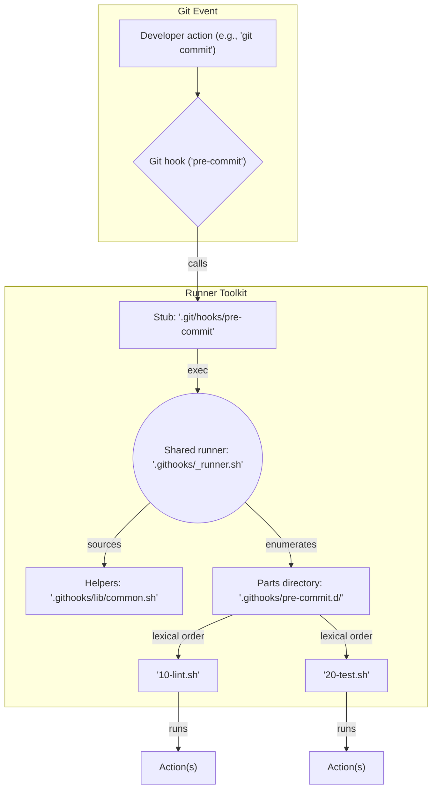

# Git Hooks Runner Toolkit

## Tired of managing Git hooks? We've got you covered.

This toolkit provides a simple, yet powerful, way to manage your Git hooks. It's designed to be composable, version-controlled, and easy to maintain. Stop letting your Git automation live in scattered shell scripts and start treating it like the code it is.

With this toolkit, you can:

- **Keep your hooks in your repository**: No more scattered scripts on different machines.
- **Compose hooks from smaller parts**: Build complex workflows from simple, reusable scripts.
- **Run hooks in a predictable order**: Parts are executed in a deterministic, lexical order.
- **Stay safe**: The runner comes with robust logging, stdin handling, and awareness of worktrees and bare repositories.
- **Enjoy zero hard dependencies**: All you need is a POSIX-compliant shell and Git.

## How it Works

The toolkit installs a universal hook runner that executes any number of "hook parts" you place in a dedicated directory. These parts are just executable shell scripts, and they run in a predictable order based on their filenames.



## Getting Started

### 1. Clone the Toolkit

Clone this repository into your project's root directory:

```bash
git clone https://github.com/DevGuyRash/git-hooks-runner-toolkit.git .githooks
```

### 2. Install the Hooks

Run the installer to set up the hooks in your repository:

```bash
.githooks/install.sh
```

This will install a curated set of hooks by default. You can also choose to install specific hooks using the `--hooks` flag:

```bash
.githooks/install.sh --hooks pre-commit,post-merge
```

To see what was installed, you can run:

```bash
ls .git/hooks
ls .githooks
```

### 3. Add Your First Hook Part

Now, let's create a simple hook part. For this example, we'll create a `pre-commit` hook that runs a linter.

Create a new file named `10-lint.sh` in the `.githooks/pre-commit.d/` directory:

```bash
cat > .githooks/pre-commit.d/10-lint.sh <<'SH'
#!/usr/bin/env bash
set -euo pipefail

# Example: run eslint if available; otherwise just log and exit 0
if command -v eslint >/dev/null 2>&1; then
  echo "[hook] INFO: running eslint"
  eslint .
else
  echo "[hook] WARN: eslint not found; skipping"
fi
SH
```

Make the script executable:

```bash
chmod +x .githooks/pre-commit.d/10-lint.sh
```

Now, whenever you make a commit, this script will run automatically.

## Advanced Usage

### Staging Hook Parts

The installer can automatically "stage" hook parts for you. This means it will copy executable scripts from a source directory to the correct `.githooks/<hook>.d/` directory.

To do this, you need to add a special comment to your script to tell the installer which hook it belongs to. For example:

```bash
# githooks-stage: pre-commit
```

Then, you can run the installer with the `--stage-source` flag:

```bash
.githooks/install.sh --stage-source <your-scripts-directory>
```

You can also stage the included examples:

```bash
.githooks/install.sh --stage-source examples
```

### Available Flags

The `install.sh` script provides several flags to customize its behavior:

| Flag | Description |
|---|---|
| `-H`, `--hooks HOOKS` | Comma-separated list of hook names to manage. |
| `-A`, `--all-hooks` | Manage every Git-documented hook. |
| `-s`, `--stage SELECTORS` | Legacy stage selector syntax. |
| `--stage-source DIR` | Add a staging source directory. |
| `--stage-hook HOOKS` | Filter target hook names for staging. |
| `--stage-name NAMES` | Filter candidate filenames for staging. |
| `--stage-order STRAT` | Control the order of the staging plan (`source`, `hook`, or `name`). |
| `-M`, `--stage-summary` | Print the staging plan before copying. |
| `-n`, `--dry-run` | Print planned actions without touching the filesystem. |
| `-f`, `--force` | Overwrite existing stubs. |
| `-u`, `--uninstall` | Remove runner artifacts and managed stubs. |
| `-h`, `--help` | Show the help message. |

### Provided Examples

The toolkit comes with several examples in the `examples/` directory. You can stage them using the `--stage-source examples` flag.

- **`dependency-sync.sh`**: Automatically runs `npm install`, `bundle install`, etc., when dependency files change.
- **`watch-configured-actions.sh`**: Run custom commands when specific files change, based on a YAML or JSON configuration file.
- **`metadata-apply.sh`**: Restores file permissions and other metadata using `metastore`.
- **`git-crypt-enforce.sh`**: Ensures that files that should be encrypted with `git-crypt` are not committed in plaintext.
