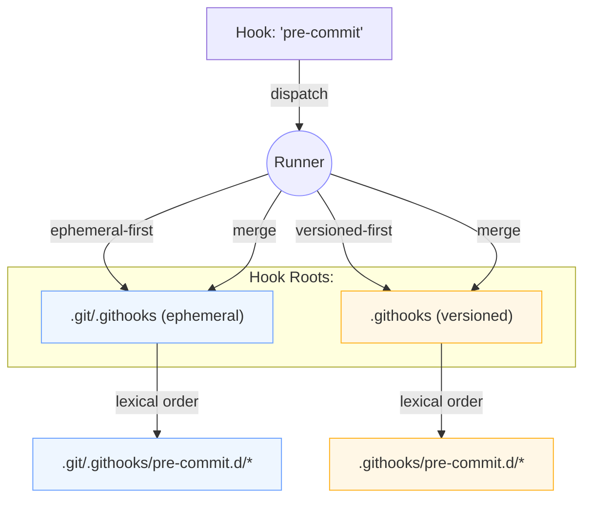

# Git Hooks Runner Toolkit

## Tired of managing Git hooks? We've got you covered

This toolkit provides a simple, yet powerful, way to manage your Git hooks. It's designed to be composable, version-controlled, and easy to maintain. Stop letting your Git automation live in scattered shell scripts and start treating it like the code it is.

With this toolkit, you can:

- **Keep your hooks in your repository**: No more scattered scripts on different machines.
- **Compose hooks from smaller parts**: Build complex workflows from simple, reusable scripts.
- **Run hooks in a predictable order**: Parts are executed in a deterministic, lexical order.
- **Stay safe**: The runner comes with robust logging, stdin handling, and awareness of worktrees and bare repositories.
- **Enjoy zero hard dependencies**: All you need is a POSIX-compliant shell and Git.

## How it Works

The toolkit installs a universal hook runner that executes any number of "hook parts" you place in a dedicated directory. These parts are just executable shell scripts, and they run in a predictable order based on their filenames.

### The `.git/hooks` Directory and the Shared Runner

When you install the toolkit, it creates a small "stub" file for each hook you want to manage in your `.git/hooks` directory. This stub file is a simple shell script that does one thing: it executes the shared runner script, which is located in `.githooks/_runner.sh`.

The shared runner then takes over and does the following:

1. It determines which hook is being run (e.g., `pre-commit`, `post-merge`, etc.).
2. It looks for a corresponding directory in `.githooks` (e.g., `.githooks/pre-commit.d`).
3. It executes all the executable scripts it finds in that directory, in lexical order.

This approach has several advantages:

- **Your `.git/hooks` directory stays clean**: You only have a small stub file for each hook, instead of a large, monolithic script.
- **Your hooks are version-controlled**: The actual hook logic lives in the `.githooks` directory, which is part of your repository.
- **Your hooks are composable**: You can easily add, remove, or reorder hook parts without having to modify a single, large script.

Here is a diagram that illustrates the process:


> **Note:** If you install in **Ephemeral Mode**, the runner lives under `.git/.githooks/` instead, and the runner dynamically overlays ephemeral parts with any versioned `.githooks` parts. See **Advanced Usage → Ephemeral Mode** below and the detailed [Ephemeral Mode guide](docs/ephemeral-mode.md).

## Getting Started

### 1. Vendor the Toolkit

You can add the toolkit to your project in two ways: as a direct clone or as a Git submodule.

#### Option 1: Direct Clone (Recommended)

This is the simplest method and is recommended for most users. It integrates the toolkit directly into your project, making hook management straightforward.

1. **Clone the repository:**

   ```bash
   git clone https://github.com/DevGuyRash/git-hooks-runner-toolkit.git .githooks
   ```

2. **Integrate it into your project:** By removing the toolkit's `.git` directory, you can track all its files within your main repository.

   ```bash
   rm -rf .githooks/.git
   ```

3. **Commit the toolkit:**

   ```bash
   git add .githooks
   git commit -m "chore: vendor git-hooks-runner toolkit"
   ```

With this approach, any custom hooks you add to `.githooks/` are simply part of your project and can be committed directly. The trade-off is that updating the toolkit requires a manual merge from the upstream repository.

#### Option 2: Git Submodule (Advanced)

If you want to keep the toolkit's history separate and update it easily, you can use a submodule. However, this is an advanced workflow that is considerably more complex, especially for teams.

**Requirement: Fork the Toolkit**:

To track custom hooks in a submodule across a team, you must first **fork** the `git-hooks-runner-toolkit` repository. You cannot use the original repository directly, because your team will need a shared remote to push custom hook changes to.

1. **Fork the repository** on GitHub.

2. **Add your fork as a submodule:** Use the URL of *your fork*.

   ```bash
   git submodule add <URL_OF_YOUR_FORK> .githooks
   git commit -m "chore: add forked git-hooks-runner as submodule"
   ```

When you add or edit hooks, they are modified *inside* the `.githooks` submodule. To share these changes, you must commit and **push** them to your fork, and then commit the updated submodule reference in your main repository.

**Workflow for updating hooks in a submodule:**

```bash
# 1. Stage your hook part into the submodule
.githooks/install.sh stage add hooks

# 2. Navigate into the submodule, commit, and push the change to your fork
(cd .githooks && git add . && git commit -m "feat: add my-custom-hook" && git push)

# 3. Return to your project and commit the updated submodule reference
git add .githooks
git commit -m "chore: update hooks submodule with my-custom-hook"
```

Because this workflow requires managing a separate forked repository and involves multiple steps, we strongly recommend the **Direct Clone** method unless you have a specific need for the submodule approach.

#### Option 3: Skip vendoring and use **Ephemeral Mode** (no tracked files)

If repository policy or workflow discourages committing tooling, you can install the runner under **`.git/.githooks/`** instead of tracking files in the repo. You may use a shared checkout of the toolkit (e.g. `~/.cache/git-hooks-runner-toolkit`) to install into any target repository.

```bash
# Fetch (or update) the toolkit locally once
git clone https://github.com/DevGuyRash/git-hooks-runner-toolkit.git \
  "$HOME/.cache/git-hooks-runner-toolkit"

# Inside the repository that should receive hooks:
cd /path/to/your-repo
"$HOME/.cache/git-hooks-runner-toolkit/install.sh" install \
  --mode ephemeral \
  --hooks pre-commit,post-merge \
  --overlay ephemeral-first
```

You can still keep **hook parts** versioned in `.githooks/` (recommended), while the runner and stubs live ephemerally under `.git/.githooks/`. See the [Ephemeral Mode guide](docs/ephemeral-mode.md) for details.

### 2. Install the Hooks

Run the installer to set up stubs and the shared runner:

```bash
.githooks/install.sh install
```

By default this installs a curated subset of Git hooks. To explicitly control which hooks receive managed stubs, pass a comma-separated list:

```bash
.githooks/install.sh install --hooks pre-commit,post-merge
```

To see what was installed, you can run:

```bash
ls .git/hooks
ls .githooks
```

You can inspect command-specific help at any time, for example:

```bash
.githooks/install.sh help stage
.githooks/install.sh stage help add
```

#### Alternative: Install in **Ephemeral Mode** (no tracked runner files)

If you have a vendored copy at `.githooks/`, you can still choose **Ephemeral Mode** to place the active runner under `.git/.githooks/` and optionally **overlay** it with your versioned parts:

```bash
# from your vendored toolkit
.githooks/install.sh install --mode ephemeral \
  --hooks pre-commit,post-merge \
  --overlay versioned-first   # or: ephemeral-first (default), merge
```

Check the resolved configuration:

```bash
.githooks/install.sh config show
```

> **Tip:** Uninstall later with:
>
> ```bash
> .githooks/install.sh uninstall --mode ephemeral
> ```

### 3. Add Your First Hook Part

Now, let's create a simple hook part. For this example, we'll create a `pre-commit` hook that runs a linter.

Create a new file named `10-lint.sh` in the `.githooks/pre-commit.d/` directory:

```bash
cat > .githooks/pre-commit.d/10-lint.sh <<'SH'
#!/usr/bin/env bash
set -euo pipefail

# Example: run eslint if available; otherwise just log and exit 0
if command -v eslint >/dev/null 2>&1; then
  echo "[hook] INFO: running eslint"
  eslint .
else
  echo "[hook] WARN: eslint not found; skipping"
fi
SH
```

Make the script executable:

```bash
chmod +x .githooks/pre-commit.d/10-lint.sh
```

Now, whenever you make a commit, this script will run automatically.

## Advanced Usage

### Adding Hook Parts

The installer can automatically add hook parts for you from a source directory.

There are two ways to tell the installer which hook a script belongs to:

1. **Metadata Comment:** Add a special comment to your script to specify the target hook(s). You can specify multiple hooks by separating them with commas.

   ```bash
   # githooks-stage: pre-commit, post-merge
   ```

2. **Directory Structure:** Place your script in a directory named after the hook. For example, a script placed in `hooks/pre-commit/` will be automatically associated with the `pre-commit` hook.

Then, you can stage parts with the `stage add` subcommand:

```bash
.githooks/install.sh stage add <your-scripts-directory>
```

You can also add the included examples:

```bash
.githooks/install.sh stage add examples
```

Limit staging to one or more filenames with `--name`. The filter accepts shell-style globs and automatically matches `.sh` extensions:

```bash
.githooks/install.sh stage add examples --name 'metadata-*'
```

### Creating and Installing Your Own Hooks

You can easily create and install your own custom hooks. The recommended way to do this is to place your hook scripts in the `hooks/` directory, and then use the `stage add` subcommand to install them.

For example, let's say you want to create a `pre-push` hook that runs your test suite. You would create a file named `hooks/pre-push/10-run-tests.sh` with the following content:

```bash
#!/usr/bin/env bash
set -euo pipefail

# githooks-stage: pre-push

echo "Running tests..."
npm test
```

Then, you would make the script executable:

```bash
chmod +x hooks/pre-push/10-run-tests.sh
```

Finally, you would stage the directory:

```bash
.githooks/install.sh stage add hooks
```

This will copy your script to `.githooks/pre-push.d/10-run-tests.sh`, and it will be executed automatically before every push.

### Managing Staged Parts

List everything that is currently staged:

```bash
.githooks/install.sh stage list
```

You can scope the listing to a single hook:

```bash
.githooks/install.sh stage list pre-commit
```

To remove a specific part, provide the hook and name (the `.sh` suffix is optional):

```bash
.githooks/install.sh stage remove pre-commit git-crypt-enforce
```

To clear every part for a hook, combine the hook with `--all`:

```bash
.githooks/install.sh stage remove pre-commit --all
```

To reverse a staging operation based on the source files, use `stage unstage`.
It scans the source directory, resolves hook targets from metadata comments or
directory placement, and removes any matching staged scripts:

```bash
.githooks/install.sh stage unstage examples --name 'dependency-sync'
```

You can reuse the same filters as `stage add`, including `--hook`, `--name`, and
`--dry-run`, to scope the unstaging plan without touching unrelated parts.

For a high-level summary of hooks, stubs, and part counts, run:

```bash
.githooks/install.sh hooks list
```

All of these commands accept `-n/--dry-run` so you can preview actions before making changes.

### Refreshing toolkit assets

After pulling new versions of the toolkit (or tweaking example scripts locally), run the `update` subcommand to rewrite the shared runner, refresh managed stubs, and restage any example-based parts in place:

```bash
.githooks/install.sh update            # standard installs
.githooks/install.sh update --mode ephemeral
```

Pass `--force` if you want to overwrite staged parts even when their contents already match the source.

### Inspecting and Updating Configuration

Use `config show` to review derived paths (including any Git `core.hooksPath` overrides):

```bash
.githooks/install.sh config show
```

If you need to relocate the hooks path, point Git at the shared runner directory:

```bash
.githooks/install.sh config set hooks-path .githooks
```

The installer will emit the Git commands it runs, and you can combine these subcommands with `--dry-run` during experimentation.

### Available Commands and Flags

The `install.sh` script provides several commands to customize its behavior:

| Command                                      | Description                                                                                                                                                               |
| -------------------------------------------- | ------------------------------------------------------------------------------------------------------------------------------------------------------------------------- |
| `install`                                    | Install the toolkit and create hook stubs. Supports `--hooks`, `--all-hooks`, `--force`, and `--mode ephemeral` (installs the runner under `.git/.githooks/`; see below). |
| `update`                                     | Refresh runner assets, managed stubs, and staged parts. Supports `--force`, `--dry-run`, and `--mode ephemeral` to target `.git/.githooks/` installs. |
| `stage add SOURCE`                           | Copy hook parts from a source directory. Supports `--hook` (alias: `--for-hook`), `--name` (globs, extension optional), `--force`, and `--dry-run`.                       |
| `stage unstage SOURCE`                       | Remove staged hook parts that match a source directory. Supports `--hook`, `--name`, and `--dry-run`.                                                                     |
| `stage remove HOOK [--name PART \| --all]`   | Remove one part by name (extension optional) or purge all parts for a hook.                                                                                               |
| `stage list [HOOK]`                          | Show staged parts for all hooks or a specific hook.                                                                                                                       |
| `hooks list [HOOK]`                          | Summarize installed stubs and staged parts.                                                                                                                               |
| `config show` / `config set hooks-path PATH` | Inspect or update toolkit configuration.                                                                                                                                  |
| `help [COMMAND [SUBCOMMAND]]`                | Display MAN-style manuals for commands and subcommands.                                                                                                                   |
| `uninstall`                                  | Remove runner artifacts and managed stubs while leaving checked-in toolkit files intact.                                                                                  |

**Global Flags:**

| Flag              | Description                                                                          |
| ----------------- | ------------------------------------------------------------------------------------ |
| `-n`, `--dry-run` | Print planned actions without touching the filesystem.                               |
| `-h`, `--help`    | Show the global help message. You can also target subcommands (e.g. `--help stage`). |
| `-V`, `--version` | Print the toolkit version.                                                           |

### Provided Examples

The toolkit comes with several examples in the `examples/` directory. Each has a
companion guide under `docs/examples/`. Stage them with:

```bash
.githooks/install.sh stage add examples
```

- **`dependency-sync.sh`** ([guide](docs/examples/dependency-sync.md)): Watches common manifests across Node, Python (pip/Poetry/Pipenv/uv/PDM), Ruby, PHP (Composer), Go, Rust, Elixir, .NET, Java (Maven/Gradle), Swift, Dart/Flutter, Bun, and CocoaPods and runs the matching install/sync command when those files change.
- **`watch-configured-actions.sh`** / **`watch-configured-actions-pre-commit.sh`** ([guide](docs/examples/watch-configured-actions.md)): Run custom commands when specific files change after merges or before commits, all driven by a shared YAML/JSON config.
- **`metadata-apply.sh`** ([guide](docs/examples/metadata-apply.md)): Restores file permissions and other metadata using `metastore`.
- **`git-crypt-enforce.sh`** ([guide](docs/examples/git-crypt-enforce.md)): Ensures that files that should be encrypted with `git-crypt` are not committed in plaintext.

> **Note:** Staging either watch-configured-actions script also installs
> `config/watch-configured-actions.yml` under your hooks root (`.githooks/config/`
> for persistent installs, `.git/.githooks/config/` for ephemeral mode) so both
> the post-event and pre-commit variants share one source of truth. If staging
> detects a legacy `.githooks/watch-config*.yml` file it prints a migration
> warning; runtime loads still succeed but also emit a warning until you move to
> the centralized location, and missing configs trigger a hint before exiting 0.

---

## Ephemeral Mode (overview)

**Ephemeral Mode** installs the runner and stubs under **`.git/.githooks/`**, so you can enable hooks without committing toolkit files. You may still keep your **hook parts** versioned in `.githooks/` and choose how ephemeral parts and versioned parts are layered via an **overlay mode**:

- `ephemeral-first` *(default)* — run ephemeral parts before any versioned parts
- `versioned-first` — run versioned parts before any ephemeral parts
- `merge` — keep both roots active without changing their default ordering



**Quick commands:**

```bash
# Install Ephemeral Mode from a vendored copy
.githooks/install.sh install --mode ephemeral --hooks pre-commit,post-merge --overlay ephemeral-first

# OR install from a shared checkout without vendoring:
"$HOME/.cache/git-hooks-runner-toolkit/install.sh" install --mode ephemeral --hooks pre-commit

# Inspect current paths and precedence:
.githooks/install.sh config show

# Uninstall Ephemeral Mode and restore previous hooksPath:
.githooks/install.sh uninstall --mode ephemeral
```

For a deeper walk‑through, see the dedicated [Ephemeral Mode guide](docs/ephemeral-mode.md).
