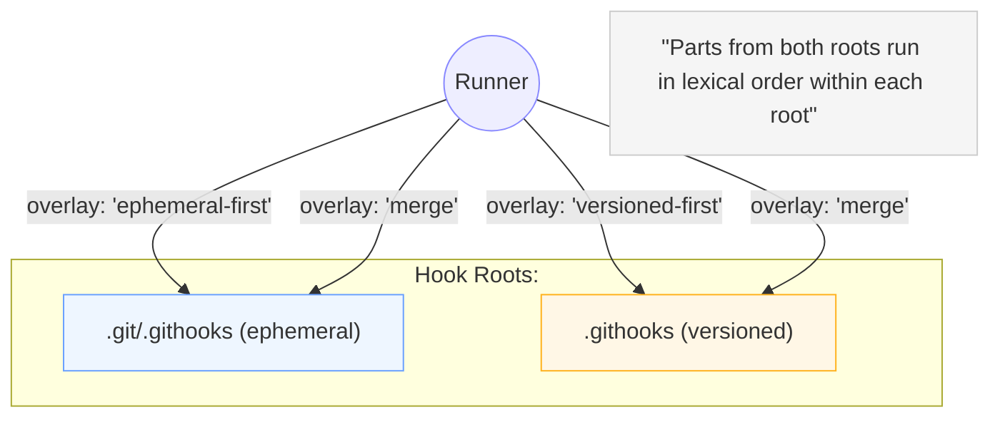
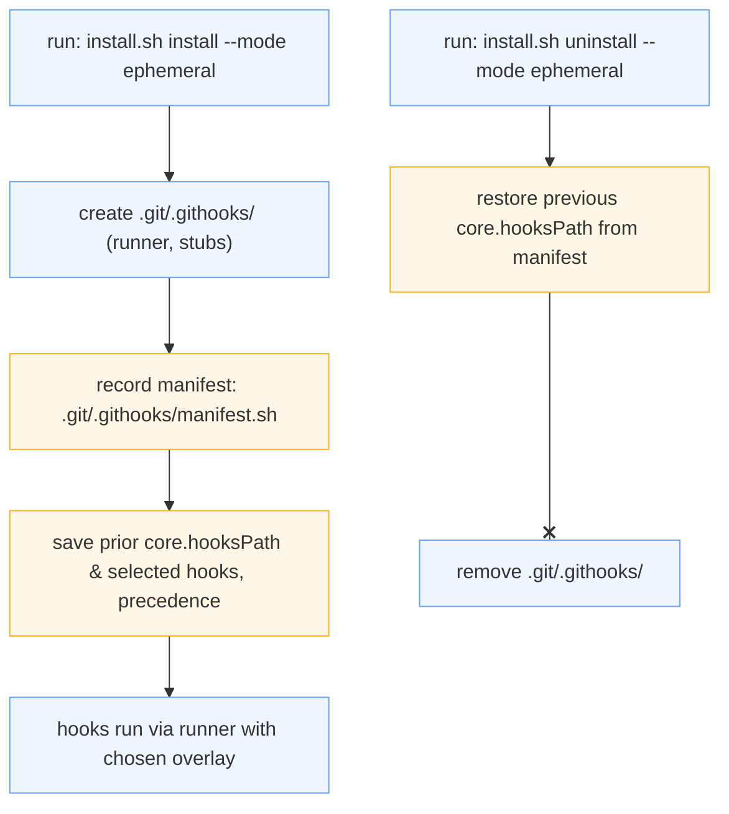

# Ephemeral Mode

## Overview

**Ephemeral Mode** installs the Git Hooks Runner Toolkit under **`.git/.githooks/`** so you can enable hook automation **without committing toolkit files**. It persists across `git pull`, `git reset --hard`, and other worktree rewrites, and it can **overlay** (combine) with a tracked `.githooks/` directory when you want local parts and versioned parts to run together.

- Runner & stubs live in: **`.git/.githooks/`**
- Your **hook parts** can remain versioned in: **`.githooks/`** *(recommended)*  
- You control which root runs first via **overlay precedence**  
  (`ephemeral-first` *(default)*, `versioned-first`, or `merge`)



## When to Use It

- You **cannot** or **prefer not** to commit tooling to the repository.
- You want to **layer local automation** on top of versioned hooks.
- You need a **reversible** install that **restores** `core.hooksPath` on uninstall.

## Prerequisites

- A writable Git repository (worktree or bare).
- `/bin/sh` (POSIX shell) and the Git CLI on `PATH`.
- A copy of this toolkit either **vendored** in the repo or **checked out elsewhere**.

## Quick Start

### A) From a vendored copy (`.githooks/`)

```bash
# Inside the target repository:
.githooks/install.sh install \
  --mode ephemeral \
  --hooks pre-commit,post-merge \
  --overlay ephemeral-first   # or: versioned-first, merge

# Inspect the active configuration:
.githooks/install.sh config show
```

### B) Without vendoring (shared checkout)

```bash
# Fetch (or update) a shared toolkit checkout once:
git clone https://github.com/DevGuyRash/git-hooks-runner-toolkit.git \
  "$HOME/.cache/git-hooks-runner-toolkit"

# Install into any repository by changing CWD:
cd /path/to/target-repo
"$HOME/.cache/git-hooks-runner-toolkit/install.sh" install \
  --mode ephemeral \
  --hooks pre-commit,post-merge \
  --overlay versioned-first
```

## Overlay Precedence

Choose how ephemeral and versioned parts are layered:

- `ephemeral-first` *(default)* — local ephemeral parts run before versioned parts.
- `versioned-first` — versioned parts run before ephemeral parts.
- `merge` — both roots stay active in their **native** ordering; runner records the relationship.

You can set the mode via:

- CLI flag: `--overlay <mode>`
- Environment: `GITHOOKS_EPHEMERAL_PRECEDENCE=<mode>`
- Git config (persisted): `git config --local githooks.ephemeral.precedence <mode>`

## Lifecycle & Manifest

On install, the toolkit captures and restores state **idempotently**:



**Commands you’ll use most:**

```bash
# Install (ephemeral):
install.sh install --mode ephemeral --hooks pre-commit --overlay ephemeral-first

# Inspect:
install.sh config show

# Uninstall (restore previous hooksPath and remove ephemeral assets):
install.sh uninstall --mode ephemeral

# Dry-run any install/uninstall:
install.sh install  --mode ephemeral --dry-run
install.sh uninstall --mode ephemeral --dry-run
```

## Compatibility Notes

- Works with **bare repos** and **linked worktrees**; the installer resolves `.git/` indirection correctly.
- Does **not** modify tracked files; all assets live under `.git/.githooks/` with restrictive permissions.
- Existing `.githooks/` directories remain untouched and are combined according to your **overlay** setting.
- Re-running the ephemeral install is **safe**; stubs and manifest are refreshed idempotently.

## Uninstall

```bash
# Inside the target repository:
install.sh uninstall --mode ephemeral

# Optional: dry-run first
install.sh uninstall --mode ephemeral --dry-run
```

The uninstall removes `.git/.githooks/`, restores the previous `core.hooksPath`, and deletes the manifest.

## Troubleshooting

- **Which hooks path is active?**
  Run:

  ```bash
  install.sh config show
  ```

  It prints `core.hooksPath`, the resolved shared runner path, and derived directories.

- **Overlay confusion?**
  Re-run install with an explicit overlay:

  ```bash
  install.sh install --mode ephemeral --overlay versioned-first
  ```

- **Uninstall didn’t restore my previous hooks?**
  Check the manifest:

  ```bash
  .git/.githooks/manifest.sh
  ```

  and re-run uninstall. If another tool changed `core.hooksPath`, simply re-run the ephemeral install to refresh stubs and precedence, then uninstall again.

- **Bare repo behavior?**
  Supported. The ephemeral directory is provisioned inside the shared Git metadata area, and stubs are created accordingly.
